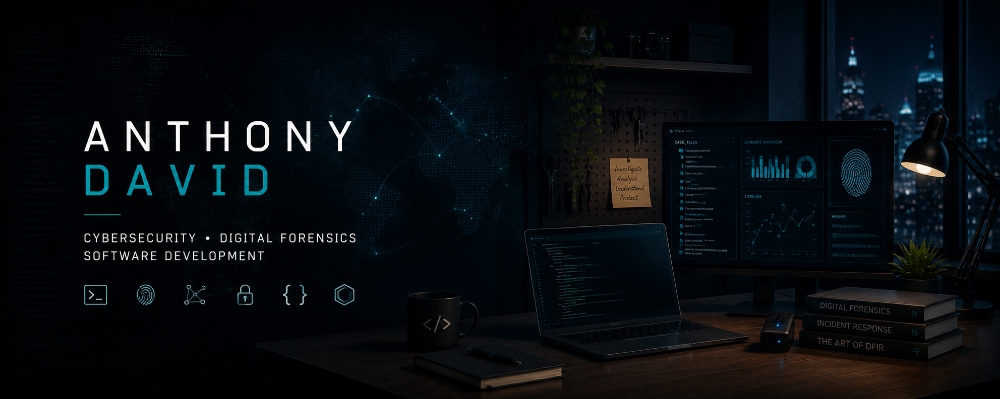

  

# Hi, I'm Anthony 👋

**Cybersecurity & Digital Forensics | Software Developer**

I'm an IT professional based in Switzerland, with a strong interest in **cybersecurity, digital forensics, incident response and software development**.

I enjoy understanding how systems work, investigating digital evidence, automating repetitive tasks and building tools that solve real-world problems.

Currently working in **Digital Forensics**, while continuously developing my skills in cybersecurity and software engineering.

---

## 🔍 What I'm interested in

* 🕵️ **Digital Forensics & Incident Response**
* 🛡️ **Cybersecurity**
* 🔎 **OSINT & Threat Intelligence**
* 🐍 **Security Automation with Python**
* 🐧 **Linux & Infrastructure**
* 🌐 **Web & Application Development**

---

## 🧰 Technologies & Tools

### Development

`Python` `JavaScript` `TypeScript` `Rust` `SQL`

### Web

`Next.js` `React` `Node.js` `HTML` `CSS`

### Cybersecurity & Forensics

`Magnet AXIOM` `Oxygen Forensics` `Nmap` `Wireshark` `Metasploit`

### Infrastructure

`Linux` `Docker` `Git` `Microsoft Azure`

---

## 🚀 Featured Projects

### 🔎 OSINT Cybersecurity Platform

Cybersecurity intelligence platform developed as part of my Bachelor's thesis.

The application collects and correlates **Indicators of Compromise (IoCs)** from multiple sources and provides tools to explore and visualize relationships between them.

**Topics:** OSINT · Threat Intelligence · IoC · Python · Data Analysis

→ [View project](#)

---

### 🛡️ Security Automation Tools

Collection of small tools and scripts designed to automate cybersecurity and investigation tasks.

**Topics:** Python · DFIR · Automation · Cybersecurity

→ [View projects](#)

---

### 🌐 Web & Application Projects

Applications and experiments focused on modern web development, UI/UX and software engineering.

**Topics:** Next.js · React · TypeScript

→ [View projects](#)

---

## 🎓 Background

🎓 **BSc in Computer Science — Information Security**

🔐 Cybersecurity & Digital Forensics

🇨🇭 Switzerland

I'm particularly interested in the intersection between **software engineering and cybersecurity** — using development to build better investigation, automation and security tools.

---

## 📚 Currently exploring

* Digital Forensics & Incident Response
* Microsoft Security & Sentinel
* Security automation
* Rust
* Modern web development
* Cloud security

---

## 📊 GitHub

---

## 🤝 Let's connect

I'm always interested in discussing **cybersecurity, digital forensics, software development and interesting technical projects**.

[LinkedIn](https://www.linkedin.com/in/anthony-david-it/) · [Website](https://anthonydavid.ch/)
